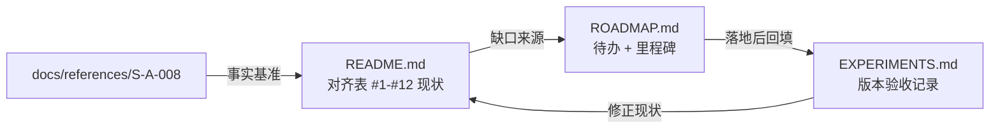
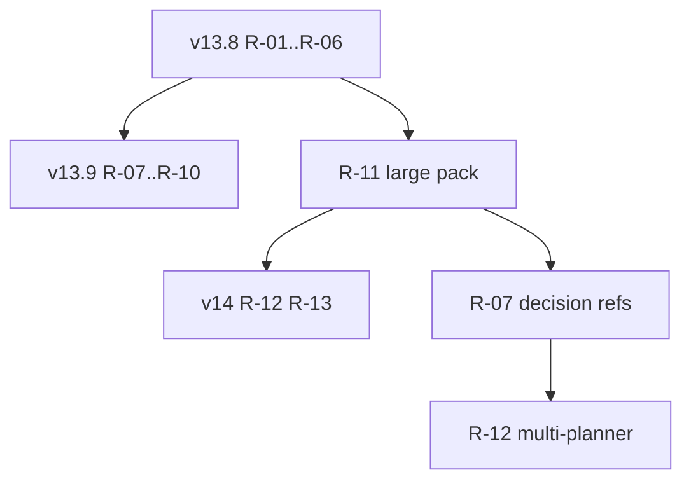

# Swarm alignment roadmap (S-A-008)

前瞻待办清单：对照 Cursor 原文
[`docs/references/S-A-008-agent-swarm-model-economics.md`](docs/references/S-A-008-agent-swarm-model-economics.md)
与当前实现，记录**机制空转缺陷**、**结构性对齐缺口**与**已声明边界**。

本文档只描述「接下来做什么」。现状对齐表见
[`README.md`](README.md) § **Fidelity boundary (v13 swarm vs S-A-008)**（行号 `#1`–`#12`）。
版本验收与 Honesty 见 [`EXPERIMENTS.md`](EXPERIMENTS.md)。

## 三份文档如何配合



**约定**：不在此复制 README 的 12 项对齐表（避免口径漂移）。条目用 `#N` 引用该表行号。

## 基线快照

| 字段 | 值 |
|---|---|
| 架构串 | `v13.7.1-swarm` |
| 分支 / SHA | `master` @ `a14039b`（2026-08-04） |
| 路线图起草日 | 2026-08-05 |
| 最近 TOML 验收 | `run-swarm-toml-v13.7`：full **92.6%**，width avg **2.73** / max 8，conflicts 5（见 EXPERIMENTS.md v13.7） |
| 行号证据截止 | `a14039b`；符号名可长期 `rg` 定位 |

## 状态图例

| 标记 | 含义 |
|---|---|
| `[ ]` | 未开始 |
| `[~]` | 进行中 |
| `[x]` | 已落地（须在 EXPERIMENTS.md 对应版本节回填验收，并视情况改 README 对齐表） |

## 条目 schema

每条固定五段，便于未来对照与勾选：

```markdown
### R-NN <一句话问题>
- 现状: <行为> — `path` / `symbol`（行号截至 a14039b）
- 目标: <期望行为>
- 改动面: <文件与函数>
- 验收: <单测 / mock / live>
- 状态: [ ] …
```

证据优先记**符号名**；行号仅作基线快照下的定位辅助。

---

## v13.8 — 机制空转修复

有机制但未按设计工作。改动小、回报高；不扩展拓扑。

### R-01 `review-diff` 只审最后一次 commit

- 现状: `runReviewStack` 曾调 `getDiff(workspaceDir)` 默认 `HEAD~1`。v13.7 TOML live 实证：7/7 次 `review-diff` 只看到 `guide/index.md`（leaf merge 后 harness 先提交 `guide: note`，再触发 review，故 `HEAD` 几乎总是记账提交）。对齐表 **#9**。
- 目标: 记录上次 review 的 tip SHA（`lastReviewSha`），`review-diff` 区间覆盖自该 SHA 以来的全部新合并；bookkeeping-only diff 时 prompt 要求空 findings。
- 改动面: `swarm.mjs`（`lastReviewSha` / metrics）、`review-stack.mjs` / `resolveReviewDiffRef`、`prompts/review-diff.md`。
- 验收: `test:review-stack`；`swarm:mock` 不回归；metrics.reviews 记录 `since_sha` / `tip_sha`。
- 状态: [x] 代码已落地（→ EXPERIMENTS.md v13.8；live 验收待跑）

### R-02 Field Guide 预算方向错 + 注入范围过窄

- 现状: `readGuideIndex` 在**读取端** `slice(0, maxLines)`（默认 80）（`orchestrator/lib/guide.mjs` / `readGuideIndex` ~L35–45）；`appendGuideNote` 写入端无限追加（~L48–61）。超预算后**新 note 永久不可见**。`GUIDE_INDEX` 仅注入 `swarm-planner` / `swarm-worker`（`orchestrator/lib/prompts.mjs` / `buildSwarmPlannerPrompt`、`buildSwarmWorkerPrompt`）；`merger`、`splitter`、`review-*`、`json-repair` 无 guide。对齐表 **#10**；原文要求 index 启动时注入**每个**智能体。
- 目标: （1）预算在写入侧生效（超限时压缩/轮换旧 findings，或拒绝并反馈，使**最近**有价值 note 可见）；（2）至少给 `merger`、`splitter`、三个 review 视角注入截断后的 guide（与原文「每个智能体」对齐；`json-repair` 可豁免）。
- 改动面: `guide.mjs`、`swarm.mjs` guide 写入路径、各 `build*Prompt` / review / merger / splitter 模板。
- 验收: 单测：append 超过 `guideMaxLines` 后 `readGuideIndex` 仍含最新 note；mock 中 merger/review prompt 含 guide 块。
- 状态: [ ]

### R-03 `integration-fix` 上下文饥饿

- 现状: swarm 曾走 `buildHealthRepairPrompt({ kind, stderr, phase })` only；v13.7 live 的 post-merge prompt 仅约 10 行错误文本。对齐表 **#8**。
- 目标: swarm 的 `integration-fix`（pre- 与 post-merge）注入 DESIGN、recent diff、`recentCrossScopeLog`。
- 改动面: `swarm-health.mjs` / `buildHealthRepairPrompt` + `formatHealthRepairContext`；`swarm.mjs` / `runIntegrationFixAgent`。
- 验收: `test:eng-feedback` 断言 prompt 含 DESIGN / diff / cross-scope；`swarm:mock` 不回归。
- 状态: [x] 代码已落地（→ EXPERIMENTS.md v13.8；live 验收待跑）

### R-04 `plan` 节点永不变 `done`（deps 死锁）

- 现状: `add_plan_node` 创建时 `status: "open"`，无收敛 transition（`orchestrator/lib/tree.mjs` / `applyAction` ~L107–137）。`depsSatisfied` 要求 plan 依赖 `status === "done"`（~L247–254）。若 planner 把 leaf 的 `deps` 指向 plan 节点，该 leaf **永久不进** `readyLeaves`。
- 目标: 二选一（实现时写进 Honesty）：（A）`applyAction` 拒绝 leaf→plan 的 `deps`；或（B）当某 plan 的全部子孙 leaf 均为 `done`/`retired`/`waived` 时自动将 plan 标 `done`。
- 改动面: `tree.mjs` + `tree` 单测；可选 planner prompt 一句说明。
- 验收: 单测覆盖「deps 指向 plan」被拒或可收敛；`test:convergence` / tree 相关脚本绿。
- 状态: [ ]

### R-05 worktree 预同步冲突静默

- 现状: leaf 结束前 `syncWorktreeWithMain` 若冲突则仅 `abortMerge(wt.path)`（`orchestrator/swarm.mjs` ~L1201–1203），无 resolve、无明确 leaf 报告字段；实现可能基于 stale base，冲突推迟到 main merge + merger。
- 目标: 至少让 leaf report / metrics 标记 `worktree_sync_conflict`（或等价），并在 worker 报告回流 planner 时可见；可选：冲突后不静默继续「当作干净」。
- 改动面: `swarm.mjs` sync 路径、metrics、report 字段。
- 验收: mock 或单测模拟 sync conflict → metrics/report 有记录；不破坏正常 merge 路径。
- 状态: [ ]

### R-06 文档口径统一（compile-checked references）

- 现状: README 对齐表 **#5** 写「`DESIGN.md` + `src/contracts.ts`」仿佛已完整实现 compile-checked references；`EXPERIMENTS.md` v13.7 Honesty 写明 **Compiler-checked decision references (prompt `D-NN` only)**。`contracts.ts` 仅 TypeScript 类型/导出校验，**不**解析或绑定 `D-NN`。
- 目标: 改 README #5 为**部分实现 / 边界**（类型级 contracts + prompt `D-NN`；完整「决策引用可编译校验」见 R-07），与 EXPERIMENTS Honesty 一致。
- 改动面: 仅 [`README.md`](README.md)（及必要时 EXPERIMENTS 交叉链接一句）。**不**在本条目改 harness 代码。
- 验收: 人工 diff README #5 与 EXPERIMENTS 不再矛盾；本路线图 R-07 仍为未完成对齐项。
- 状态: [ ]

---

## v13.9 — 对齐补强 + 测量前置

在机制不再空转的前提下补原文难项，并解决「测不出」问题。

### R-07 可编译校验的决策引用

- 现状: planner/worker prompt 建议 `D-01`… 编号；无 harness 解析 DESIGN 决策 ID，也无「DESIGN 改条 → 依赖代码构建失败」的传导。对齐表 **#5**（完整解法）；S-A-008「规划器之间的冲突」核心机制。
- 目标: 最小可验证方案（实现前可再开设计）：例如 `src/contracts.ts`（或生成物）导出/注释绑定决策 ID，变更 DESIGN 编号或删除决策时 tsc/自检失败；或 harness 扫描代码中的 `D-NN` 引用与 DESIGN 一致性。
- 改动面: workspace 骨架、`contracts` 约定、可选 `swarm-task-pack` skill、planner/worker prompt；单测。
- 验收: 单元/集成：删改 DESIGN 中已引用决策 → build 或 harness check 失败；mock 不误杀无引用决策。
- 状态: [ ]
- 依赖: R-06（文档先诚实）建议先完成；测量充分性依赖 R-11。

### R-08 review 视角去相关

- 现状: `review-diff` 与 `review-codebase` 均 `composer-2.5-fast`；仅 `review-spec` 为 strong（`config.json`）。`spawnAgent` 已落盘 `runs/.../logs/<logKey>-prompt.txt` / `.log`，**无任何 review 视角回读 worker 完整轨迹**。对齐表 **#9**；原文试验过「完整对话 / 仅输出 / 仅代码库」并强调低相关叠加。
- 目标: （1）至少让一个 cheap 视角与另一个换模型或换强个性 system 段；（2）增加可选「worker 轨迹摘要」视角（截断 log，非分数），或扩展现有视角之一。
- 改动面: `config.json`、`review-stack.mjs`、新/改 prompt；注意 hidden grader（不得注入 suite 分数）。
- 验收: mock 三视角角色/模型不同；轨迹视角（若做）只见 log 摘要不见 score。
- 状态: [ ]
- 依赖: R-01（diff 窗口修好后再谈审查 ROI 更有意义）。

### R-09 swarm `add_task` scope 重叠未校验

- 现状: `validateDisjointScopes`（`orchestrator/lib/tasks.mjs`）仅被 legacy `run.mjs` 用于静态 `tasks.json`；swarm `applyAction`/`add_task` **不**校验两 leaf 串行共享同一 `files_scope` 文件。并行互斥靠 `scopeDisjoint`（`width-policy.mjs`），防的是**同时**跑，不是重复实现。对齐表 **#1** 周边 / 脑裂缓解。
- 目标: 选定策略并落地：（A）拒绝重叠 scope 的并行-ready 叶子对；（B）写入 `ACTION_ERRORS` 告警并建议 `deps`；（C）重叠则强制 deps 串行。策略写进 Honesty。
- 改动面: `tree.mjs` / `swarm.mjs` action 循环、`tasks.mjs` 复用或抽取、单测。
- 验收: 单测覆盖重叠 scope 的拒绝或告警；`swarm:mock` 绿。
- 状态: [ ]

### R-10 模型经济性口径与再测

- 现状: S-A-008 称 worker 至少占 **69%** token、多数 run **>90%**。本仓库早期实验笔记曾观察到 worker 份额明显更低、`integration-fix` 占比偏高——但 v13.6/v13.7 的 `metrics.json` **已不在当前工作树**，不得把旧数字当作现行基线。对齐表 **#2** / 模型经济性章节。
- 目标: （1）在 `report:task-run` / `compare-runs` 固定「按 role 归账」口径（worker vs merger vs review vs planner vs integration-fix）；（2）在下一次 TOML（或同等）live 验收中重新测量并写入 EXPERIMENTS；（3）若 integration-fix 仍过高，结合 R-03 与显式模型配置再评估。
- 改动面: `metrics.mjs`、`report-task-run.mjs`、`compare-runs.mjs`；文档口径；live 命令见 EXPERIMENTS 惯例。
- 验收: REPORT 出现稳定的 role token 表；新 live run 小节含 worker% 与 honesty（是否与 Cursor 会计口径不可比）。
- 状态: [ ]

### R-11 大 task pack（测量前置，gate 住 v14）

- 现状: v13.7 TOML live width avg **2.73** / max 8；多数协调机制与 v13.7 新门禁在 live 上触发次数极低——无法区分「机制有效」与「机制未触发」。现有 packs（CommonMark / toml-json / sqlite-micro）可在偏窄宽度下完成。`EXPERIMENTS.md` 已提示宽 L2 需要超出单 context 的 pack。
- 目标: 至少一个新（或大幅加厚）task pack：规范/接口面超出单 agent 舒适窗口，迫使 planner 拆出多条可并行、scope 易冲突的 leaf；作为 v14 与 R-07/R-12 的**测量门闩**。
- 改动面: `tasks/<pack>/`、skill `swarm-task-pack`、mock 骨架；不要求首轮达 Cursor SQLite 规模。
- 验收: ladder/swarm mock 可跑；至少一次 live 或长 mock 显示 width / merge / design 冲突等指标明显高于 TOML v13.7 基线（阈值写进该 pack 的 TASK.md）。
- 状态: [ ]

---

## v14 — 结构性（依赖 R-11）

未满足 R-11 前**不要**开工；否则无法验证。

### R-12 多 planner 并发

- 现状: `plannerPromise` 单槽位；`shouldInvitePlanner` 要求 `!plannerPromise`；轮次串行 settle（`orchestrator/swarm.mjs` ~L1512、~L1920、~L2115）。同一时刻至多一个 planner agent。S-A-008「脑裂设计」「规划器之间的冲突」的**前提**（多 planner）在结构上不成立；v13.7 相关机制实际作用在 planner↔leaf / planner↔worker。对齐表 **#1** 延伸。
- 目标: 支持有界的并发 planner（或子树级 planner），并让 DESIGN 三方合并 / 决策引用（R-07）在 **planner↔planner** 对抗下可测。
- 改动面: `swarm.mjs` 事件循环、DESIGN 合并所有权、metrics（planner 并发度）、大量 prompt。
- 验收: R-11 pack 上 live/长跑：出现真实 planner 级设计冲突并被合并/校验；Honesty 写明与单 planner 基线的成本对比。
- 状态: [ ]
- 依赖: **R-11**；强烈建议 **R-07** 已落地。

### R-13 递归子 planner / 子树委派

- 现状: `kind: "plan"` 仅为组织节点，无挂载 agent；可执行单元只有 `kind: "leaf"`（`orchestrator/lib/tree.mjs`）。`maxTreeDepth` 默认 **2**（`config.json`）限制 parent 链深度，不是「子 planner 递归」。对齐表 **#3**；原文「递归细分 / 委派子树」的上下文效率论断目前只在**单层** planner→leaf 成立。
- 目标: plan 节点可委派子 planner（或等价子编排），子树内上下文与 DESIGN 作用域边界清晰；深度与预算可配置。
- 改动面: tree 语义、spawn 模型、DESIGN/guide 作用域、停止条件；实验协议大改。
- 验收: R-11+ pack；对比单层 vs 递归在质量/token/冲突上的差异；写入 EXPERIMENTS。
- 状态: [ ]
- 依赖: **R-11**、**R-12**（或明确的阶段性子集设计）。

---

## Non-goals（声明边界）

以下内容**刻意不做**；讨论前先读「改变判断的条件」。对齐表已标 Boundary 的条目与此一致。

### NG-01 自建高吞吐 VCS

- 边界: 维持 **git worktrees + 串行 MergeQueue**（对齐表 **#4**）。原文峰值约每秒千次提交，本 harness 数量级不同。
- 理由: 成本与复杂度远超当前任务规模；merge 串行已是可测的协调地板。
- 改变判断: 现有 VCS 成为可测瓶颈（例如冲突/等待主导 wall time），且有可复现的吞吐实验协议时再开题。

### NG-02 数百并发 agent

- 边界: `swarm.concurrency` 为 cap（默认 8）；demand width 实际更窄。
- 理由: merge queue 串行下限；数百 agent 无自定义 VCS 会放大无效忙碌。
- 改变判断: NG-01 重开或 merge 路径不再是串行地板之后。

### NG-03 Field Guide 训练侧 reward

- 边界: 不实现「为后继者写作 → 奖励」的训练回路；仅 harness 内 stigmergy（guide 文件 + 注入）。
- 理由: 超出本仓库编排实验范围（属模型训练）。
- 改变判断: 明确接入可训练/可打分的后继轨迹实验时。

### NG-04 直接复刻 835 页 Rust SQLite 全文规模

- 边界: sqlite-micro 等为**形状保真**，非规模保真（EXPERIMENTS Honesty 已有类似表述）。
- 理由: 计算与人工审计成本；R-11 只要求「超出单 context」而非全文手册。
- 改变判断: 有专用算力预算与反作弊审计流程，且 R-11–R-13 已在中等 pack 上稳定。

---

## 建议实施顺序（对照用）



1. v13.8 全部（含 R-06 文档）→ 机制不再空转。  
2. R-11 与 R-07/R-08/R-09/R-10 可部分并行，但 **v14 必须等 R-11**。  
3. R-12 / R-13 最后。

---

## 如何维护本文档

1. 条目开工时把状态改为 `[~]`；合并后改为 `[x]`，并在同一 PR 或紧随 PR 中：  
   - 在 [`EXPERIMENTS.md`](EXPERIMENTS.md) 增加对应版本节（协议 + Honesty + 命令）；  
   - 若改变「已复现 / 边界」语义，更新 [`README.md`](README.md) 对齐表 `#N` 行。  
2. **不要**在 ROADMAP 粘贴完整对齐表副本。  
3. 基线 SHA / 行号过期时：更新「基线快照」表，并修正仍开放条目的行号（或改为只留符号名）。  
4. 新发现的缺陷：分配下一个 `R-NN`，放入合适里程碑；不要塞进 Non-goals 除非确认永不做。

## 变更记录

| 日期 | 条目 | 变化 | EXPERIMENTS / 备注 |
|---|---|---|---|
| 2026-08-05 | （文档） | 初版：R-01–R-13 + NG-01–NG-04，基线 `a14039b` / v13.7.1 | 分析来源：S-A-008 对照（只读）；无代码改动 |
| 2026-08-06 | R-01, R-03 | 代码落地：`lastReviewSha` review 窗口 + integration-fix 上下文 | EXPERIMENTS.md v13.8；unit/mock only |
